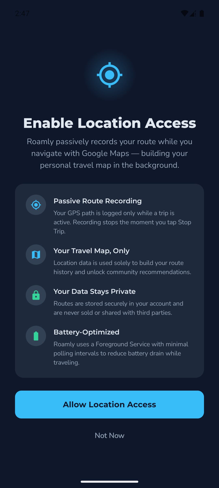
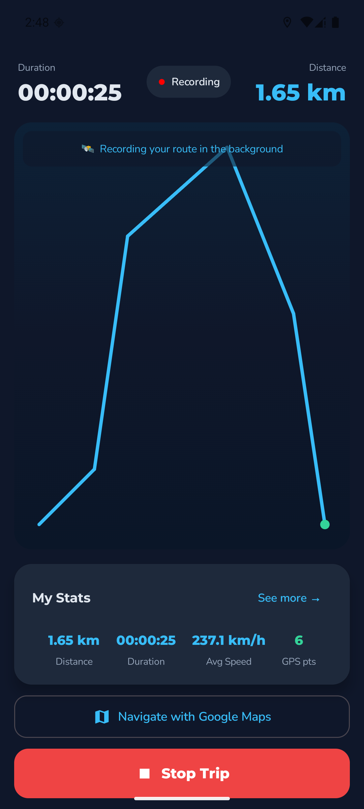
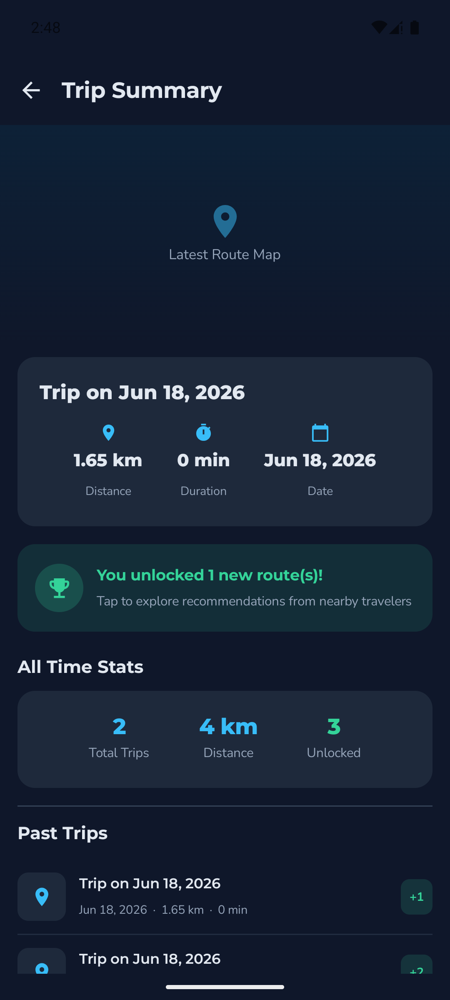

# Tutorial: Recording GPS Routes in the Background on Android

**CS5520 Final Tutorial Report**
**Prepared by:** An Nguyen
**Course:** CS5520 — Mobile Application Development, Northeastern University (Summer 2026)
**Reference app:** Roamly — <https://github.com/aqn96/roamly>

---

## 1. Introduction

Many mobile apps need to record *where the user actually went* — fitness trackers, delivery apps,
and travel apps all log a GPS trail. Doing this correctly on Android requires two pieces that work
together:

1. **`FusedLocationProviderClient`** (from Google Play Services Location) — the modern, battery-aware
   API for receiving a stream of GPS fixes.
2. **A Foreground Service** — so location keeps being logged while the user is in another app (e.g.
   navigating in Google Maps), with a persistent notification telling the user recording is active.

### What is this utility, exactly?

**`FusedLocationProviderClient`** is the location client from the **Google Play Services Location**
library (`com.google.android.gms:play-services-location`). It is called *fused* because it
transparently blends GPS, Wi-Fi, cell-tower, and motion-sensor signals into a single, smoothed
location stream, and it lets you trade accuracy against battery through a declarative
`LocationRequest` (update interval, priority, and minimum distance). It replaces the older
`android.location.LocationManager` and is the approach Google recommends for almost all apps.

A **Foreground Service** is a long-running Android `Service` that the operating system keeps alive
*because* it continuously shows the user an ongoing notification. It is the officially supported way
to run user-visible work — such as location logging, music playback, or navigation — when your app is
not on screen.

Why both are needed *together*: on its own, `FusedLocationProviderClient` stops delivering updates
once your app is backgrounded (and modern Android increasingly restricts background location). Hosting
the location client **inside a Foreground Service** is what makes continuous, *background* route
recording reliable and policy-compliant. That pairing — a fused location stream driven from a
foreground service, surfaced to Jetpack Compose — is the utility this tutorial teaches.

This report is a step-by-step tutorial for building exactly that: a feature that, on **Start Trip**,
begins logging the device's GPS path in the background, draws the route live, and saves it when the
user taps **Stop Trip**. The working reference is **Roamly**, a travel app where contributing your own
recorded routes unlocks recommendations from other travelers.

The report is organized as: why this utility is *not* part of the course (§2), background on the two
APIs (§3), prerequisites (§4), a step-by-step implementation with code and screenshots (§5–6), a
pointer to the full working app (§7), and a conclusion (§8).

---

## 2. Why this utility is not covered in the course

The eight course modules (`docs/week1.pdf`–`week8.pdf`) cover Kotlin, the Activity lifecycle, Jetpack
Compose, Navigation, ViewModel/StateFlow, Notifications, runtime permissions, `BroadcastReceiver`,
`LazyColumn`, and Retrofit networking. **Neither the Google Play Services Location APIs
(`FusedLocationProviderClient`) nor Android `Service` / Foreground Services appear anywhere in the
course.**

| Course Week | Topic | Related but *different* |
|---|---|---|
| Week 6 | ViewModel, StateFlow, **Notifications**, **runtime permissions**, BroadcastReceiver | Teaches `NotificationChannel` and `ActivityResultContracts.RequestPermission` — but only for *status-bar alerts*, never tied to a Service or to location |
| Week 8 | Retrofit networking | Background work via coroutines, but no `Service` and no location |

So while this tutorial *reuses* two course building blocks (a runtime-permission request and a
notification channel), its **novel core — receiving GPS updates with `FusedLocationProviderClient`
inside a `Service` that runs in the foreground — is entirely new material.**

---

## 3. Background: the two APIs

**`FusedLocationProviderClient`** fuses GPS, Wi-Fi, and cell signals into a single location stream.
You describe what you want with a `LocationRequest` (update interval, priority/accuracy, minimum
distance) and receive results through a `LocationCallback`. It lives in the
`com.google.android.gms:play-services-location` artifact.

**A Foreground Service** is an Android `Service` promoted to "foreground" with
`startForeground(...)`, which requires an ongoing notification. The OS treats it as user-visible work
and won't casually kill it — essential for continuous location logging while the user is elsewhere.

The challenge that ties them together: a `Service` and the Compose UI are separate lifecycles, so we
need a way to share the growing list of GPS points between them. We solve that with a process-wide
`StateFlow` (§5.4).

---

## 4. Prerequisites

- Android Studio (recent stable), a device/emulator on **API 28+**.
- A Jetpack Compose project (the course's standard setup).
- On an emulator, simulate movement with **Extended Controls → Location** or
  `adb emu geo fix <lon> <lat>`.

---

## 5. Step-by-step implementation

### 5.1 Add the dependency

In the version catalog (`gradle/libs.versions.toml`) and the app `build.gradle.kts`:

```kotlin
// libs.versions.toml
playServicesLocation = "21.3.0"
play-services-location = { group = "com.google.android.gms", name = "play-services-location", version.ref = "playServicesLocation" }

// app/build.gradle.kts — dependencies { }
implementation(libs.play.services.location)
```

### 5.2 Declare permissions and the service in `AndroidManifest.xml`

```xml
<!-- GPS route logging -->
<uses-permission android:name="android.permission.ACCESS_FINE_LOCATION" />
<uses-permission android:name="android.permission.ACCESS_COARSE_LOCATION" />
<!-- Foreground Service keeps logging while another app is in front -->
<uses-permission android:name="android.permission.FOREGROUND_SERVICE" />
<uses-permission android:name="android.permission.FOREGROUND_SERVICE_LOCATION" />
<!-- Android 13+ runtime permission for the ongoing notification -->
<uses-permission android:name="android.permission.POST_NOTIFICATIONS" />

<application ...>
    <service
        android:name=".location.TripLocationService"
        android:exported="false"
        android:foregroundServiceType="location" />
</application>
```

`FOREGROUND_SERVICE_LOCATION` and `android:foregroundServiceType="location"` are required on Android
14+ for a location-typed foreground service.

### 5.3 Model a single GPS sample

```kotlin
// data/TrackPoint.kt — one recorded GPS sample; a trip is an ordered list of these.
data class TrackPoint(
    val latitude: Double,
    val longitude: Double,
    val timestampMs: Long,
)
```

### 5.4 A process-wide source of truth (`StateFlow`)

The Service writes points here; the UI observes them. A single `object` gives the Service and the UI
one shared stream without dependency injection:

```kotlin
// location/TripSession.kt
object TripSession {
    private val _points = MutableStateFlow<List<TrackPoint>>(emptyList())
    val points: StateFlow<List<TrackPoint>> = _points.asStateFlow()

    private val _isRecording = MutableStateFlow(false)
    val isRecording: StateFlow<Boolean> = _isRecording.asStateFlow()

    var startElapsedMs: Long = 0L; private set

    fun begin() { _points.value = emptyList(); startElapsedMs = SystemClock.elapsedRealtime(); _isRecording.value = true }
    fun addPoint(p: TrackPoint) { _points.update { it + p } }          // new list -> StateFlow emits
    fun end() { _isRecording.value = false }

    /** Great-circle route length in metres. */
    fun distanceMeters(pts: List<TrackPoint> = _points.value): Double {
        if (pts.size < 2) return 0.0
        var total = 0.0; val out = FloatArray(1)
        for (i in 1 until pts.size) {
            Location.distanceBetween(pts[i-1].latitude, pts[i-1].longitude, pts[i].latitude, pts[i].longitude, out)
            total += out[0]
        }
        return total
    }
}
```

### 5.5 The Foreground Service

This is the heart of the tutorial — a `Service` that requests location updates and feeds each fix into
`TripSession`, while showing a persistent notification:

```kotlin
// location/TripLocationService.kt
class TripLocationService : Service() {

    private lateinit var fusedClient: FusedLocationProviderClient

    private val locationCallback = object : LocationCallback() {
        override fun onLocationResult(result: LocationResult) {
            result.locations.forEach { loc ->
                TripSession.addPoint(TrackPoint(loc.latitude, loc.longitude, System.currentTimeMillis()))
            }
        }
    }

    override fun onCreate() {
        super.onCreate()
        fusedClient = LocationServices.getFusedLocationProviderClient(this)
    }

    @SuppressLint("MissingPermission") // permission verified by the UI before starting the service
    override fun onStartCommand(intent: Intent?, flags: Int, startId: Int): Int {
        startAsForeground()
        val request = LocationRequest.Builder(Priority.PRIORITY_HIGH_ACCURACY, 4000L)
            .setMinUpdateIntervalMillis(2000L)
            .setMinUpdateDistanceMeters(5f)
            .build()
        fusedClient.requestLocationUpdates(request, locationCallback, Looper.getMainLooper())
        return START_STICKY                       // restart if the OS kills us
    }

    override fun onDestroy() {
        fusedClient.removeLocationUpdates(locationCallback)
        super.onDestroy()
    }

    override fun onBind(intent: Intent?): IBinder? = null

    private fun startAsForeground() {
        val channel = NotificationChannel("trip_recording", "Trip Recording", NotificationManager.IMPORTANCE_LOW)
        getSystemService(NotificationManager::class.java).createNotificationChannel(channel)
        val notification = NotificationCompat.Builder(this, "trip_recording")
            .setContentTitle("Roamly is recording your route")
            .setContentText("Logging your path in the background 🛰")
            .setSmallIcon(android.R.drawable.ic_menu_mylocation)
            .setOngoing(true)
            .build()
        if (Build.VERSION.SDK_INT >= Build.VERSION_CODES.Q) {
            ServiceCompat.startForeground(this, 2001, notification, ServiceInfo.FOREGROUND_SERVICE_TYPE_LOCATION)
        } else {
            ServiceCompat.startForeground(this, 2001, notification, 0)
        }
    }
}
```

### 5.6 Request location permission at runtime (Compose)

Before starting the service, ask for permission with the course's `rememberLauncherForActivityResult`
pattern (one of the reused building blocks):

```kotlin
// in LocationPermissionScreen.kt
val permissionLauncher = rememberLauncherForActivityResult(
    ActivityResultContracts.RequestMultiplePermissions()
) { onAllowClicked() }                            // proceed once the user responds

val requested = buildList {
    add(Manifest.permission.ACCESS_FINE_LOCATION)
    add(Manifest.permission.ACCESS_COARSE_LOCATION)
    if (Build.VERSION.SDK_INT >= Build.VERSION_CODES.TIRAMISU) add(Manifest.permission.POST_NOTIFICATIONS)
}.toTypedArray()

Button(onClick = { permissionLauncher.launch(requested) }) { Text("Allow Location Access") }
```



### 5.7 Start/stop the service from a ViewModel

The ViewModel launches the Foreground Service and exposes the live route + a derived distance as
`StateFlow` (course Topic 6 pattern), so the UI just observes:

```kotlin
// ui/screens/trip/TripViewModel.kt
class TripViewModel : ViewModel() {
    val routePoints: StateFlow<List<TrackPoint>> = TripSession.points
    val isRecording:  StateFlow<Boolean>         = TripSession.isRecording

    val distanceKm: StateFlow<Double> = TripSession.points
        .map { TripSession.distanceMeters(it) / 1000.0 }
        .stateIn(viewModelScope, SharingStarted.WhileSubscribed(5_000), 0.0)

    fun startTrip(context: Context) {
        if (isRecording.value) return
        TripSession.begin()
        ContextCompat.startForegroundService(context, Intent(context, TripLocationService::class.java))
    }

    fun stopTrip(context: Context) {
        TripSession.end()
        context.stopService(Intent(context, TripLocationService::class.java))
    }
}
```

### 5.8 Render the live route with a Compose `Canvas`

The screen observes the ViewModel with `collectAsStateWithLifecycle()`, starts the service on first
composition, and draws the points as a polyline. (Drawing on a `Canvas` keeps the app on Firebase's
free tier — in production this would be a Google Maps `Polyline`; the recorded data is identical.)

```kotlin
@Composable
fun ActiveTripScreen(tripViewModel: TripViewModel = viewModel()) {
    val context = LocalContext.current
    val routePoints by tripViewModel.routePoints.collectAsStateWithLifecycle()
    LaunchedEffect(Unit) { tripViewModel.startTrip(context) }   // begin logging when shown
    // ... draw routePoints as connected lines on a Canvas (normalised to the box) ...
}
```

```kotlin
Canvas(modifier = Modifier.fillMaxSize().padding(28.dp)) {
    val minLat = points.minOf { it.latitude }; val maxLat = points.maxOf { it.latitude }
    val minLng = points.minOf { it.longitude }; val maxLng = points.maxOf { it.longitude }
    val offsets = points.map {
        Offset(
            (((it.longitude - minLng) / (maxLng - minLng)) * size.width).toFloat(),
            ((1.0 - (it.latitude - minLat) / (maxLat - minLat)) * size.height).toFloat(), // flip Y (north = up)
        )
    }
    for (i in 1 until offsets.size) drawLine(RoamlyElectric, offsets[i-1], offsets[i], strokeWidth = 10f, cap = StrokeCap.Round)
    offsets.lastOrNull()?.let { drawCircle(RoamlyAurora, radius = 14f, center = it) }
}
```

---

## 6. Running it

1. Tap **Start Trip** → grant Location (and, on Android 13+, Notification) permission.
2. Move the device (or play a route on the emulator). The blue polyline draws live; duration,
   distance, and speed update in real time; the ongoing notification confirms background recording.
3. Tap **Stop Trip** → the service stops and the recorded route + stats are shown.

| Active recording (live polyline) | Trip summary (saved route) |
|---|---|
|  |  |

---

## 7. Reference code — a fully working app

The complete, runnable implementation is in **Roamly**: <https://github.com/aqn96/roamly>

The files that make up this utility:

| File | Role |
|---|---|
| `app/src/main/java/com/roamly/app/data/TrackPoint.kt` | GPS sample model |
| `app/src/main/java/com/roamly/app/location/TripSession.kt` | Shared `StateFlow` source of truth |
| `app/src/main/java/com/roamly/app/location/TripLocationService.kt` | The Foreground Service + `FusedLocationProviderClient` |
| `app/src/main/java/com/roamly/app/ui/screens/trip/TripViewModel.kt` | Start/stop + derived distance |
| `app/src/main/java/com/roamly/app/ui/screens/trip/ActiveTripScreen.kt` | Live route Canvas + stats |
| `app/src/main/java/com/roamly/app/ui/screens/home/LocationPermissionScreen.kt` | Runtime permission request |
| `app/src/main/AndroidManifest.xml` | Permissions + service declaration |

To run: clone the repo, add your own `google-services.json` to `app/`, open in Android Studio, and run
on an API 28+ device/emulator (see the repo `README.md`).

---

## 8. Conclusion

This tutorial showed how to record a GPS route in the background by combining two technologies that
the course does not cover: **`FusedLocationProviderClient`** for a battery-aware location stream and a
**Foreground Service** for continuous, user-visible logging. The key design idea is decoupling the
Service from the UI through a process-wide `StateFlow` (`TripSession`), which lets the recorded route
flow cleanly into a ViewModel and a Compose `Canvas`. The result — a live, drawable, persistable
route — is the sensing backbone of Roamly's "contribute a trip to unlock recommendations" model, and
the same pattern applies to any fitness, delivery, or navigation app that needs to answer the question
*"where did the user actually go?"*
